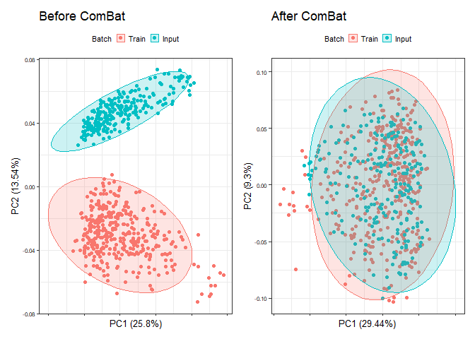
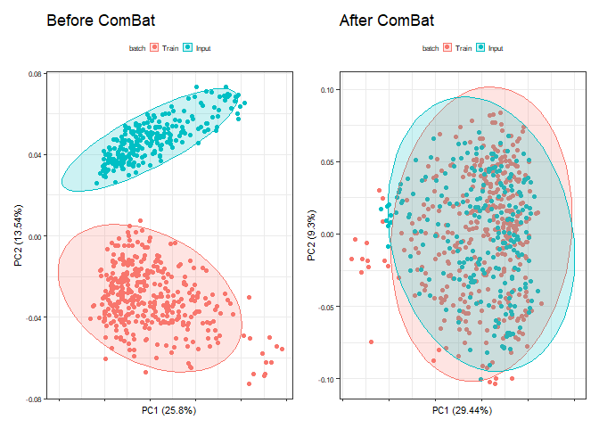
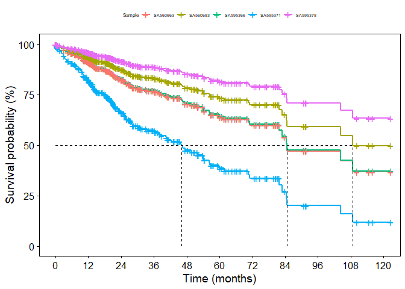
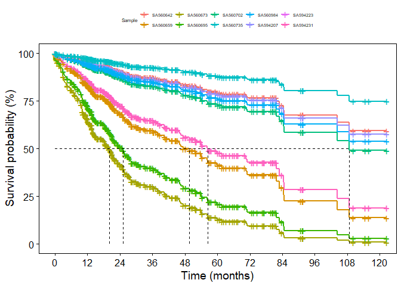

<!-- README.md is generated from README.Rmd. Please edit that file -->

# oncoClassSurv

<!-- badges: start -->

\[\[Lifecycle: stable\]\] <!-- badges: end -->

### Introduction

Hi, I’m Yang Li. This is an R package I wrote based on my analysis
needs. The current R package involves two main fields: classifier for
molecular characteristics, and survival risk over time. The function
also provides useful visual output. We initially use this R package for
hepatocellular carcinoma (HCC), but actually, other tumor types can also
benefit from it based on customized training data. In the era of
precision medicine, the molecular characteristics of patients are
increasingly valued for precise management and scientific research. The
evaluation of tumor molecular classifications is a prerequisite for
achieving precise medical management. Based on pre-analyzed or learned
sub-types with diverse clinical features (response to drugs, survival
outcomes, etc.) and sub-type-specific marker genes, machine learning
algorithms could be used for classification training, and thereafter
personalized typing prediction could be achieved for any new-diagnosed
patients. This classification can be used to guide clinical treatment
and further scientific research. The prognosis evaluation of tumor
patients is another important field for clinical researchers. So far,
there have been many nomograms based on gene expression for every type
of tumor, which are dazzling. Although some of them are excellent, many
nomograms lack external validation and are not convenient for external
clinical practice validation. To address this practicality issue, we
provide a calculation tool based on custom prognostic features, where
users can only use gene expression data or choose to add additional
clinical covariates such as age, gender, stage, etc. This function can
calculate the prognostic risk of each patient at different time points
and plot a survival curve for each patient.

### Installation

#### 1.online

    if(!require(devtools))install.packages("devtools")
    if(!require(oncoClassSurv))devtools::install_github("OliveryYL/oncoClassSurv",upgrade = FALSE,dependencies = TRUE)

#### 2.local

Click the green button “code” on this page, then click “Download ZIP” to
download it to your working directory. Install it with
`devtools::install_local("oncoClassSurv-master.zip",upgrade = F,dependencies = T)`.

### Functions

The oncoClassSurv() provides three optional tasks based on two training
and predicting processes: (1) classifier; and (2) survival risk over
time. Users can select one task from the three tasks. Among them,
“task=1” means only calculating the classifications for patients;
“task=2” means only calculating the survival risk over time for
patients; “task=3” means calculating the classifications and survival
risk over time for patients. When the function of classification is
being performed, there are two available machine learning algorithms:
random forest (RF) and support vector machine (SVM). Notably, for the
prediction of HCC, we found high consistency between the RF and SVM
algorithms, and have set the optimal parameter of predicting HCC as the
default value of the R package. For other cancers, it is recommended to
validate the accuracy and consistency of prediction before conducting
large-scale predictions.

### Example

This is an example for predicting classifications when task=1 using
“RF”:

``` r
library(oncoClassSurv)
results<-oncoClassSurv(input.exp.path = system.file("extdata", "icgc.tumor.exp.fpkm.txt",
                                                    package = "oncoClassSurv"),
                       input.clin.path = system.file("extdata", "input_clinsurv.txt",
                                                     package = "oncoClassSurv"),
                       miss_go.on=T,
                       task=1,rm.batch.effect=TRUE,plot.combatch=TRUE,
                       print.combat.plots=TRUE,
                       cluster.method="SVM")
#> Input: 492 Features, 243 Samples.
#> 
#> Please check your input features!
#> Notice: Default option is to continue when missing features exist in the input data, which may cause reduced accuracy.
#> Number of Marker features in the train data: 521, but 492 in your input data.
#> 
#> Missing features: PKM,IGKV3_11,IGHG2,IGKV4_1,IGKV3_20,IGHG3,IGHG1,IGKC,IGLC2,IGLV3_19,IGHG4,IGLV2_23,IGLC3,OR2I1P,IGHA1,IGHM,RIDA,ETNPPL,TKFC,SC5D,MSMO1,HJV,SELENOP,RACK1,CYP2B7P,ATP5MC2,NOP53,LRRC75A_AS1,RPL9P9
#> Input data is performing log2(expression+1)...
#> log2(expression+1) finished.
#> Found2batches
#> Adjusting for0covariate(s) or covariate level(s)
#> Standardizing Data across genes
#> Fitting L/S model and finding priors
#> Finding parametric adjustments
#> Adjusting the Data
```



``` r
results$original_combat.plots
```


``` r
head(results$svm.cluster$svm.cluster.pred)
#>                ID svm.cluster.pred
#> SA595366 SA595366               C2
#> SA560663 SA560663               C1
#> SA560683 SA560683               C1
#> SA595371 SA595371               C2
#> SA595378 SA595378               C2
#> SA560661 SA560661               C1
```

This is an example for predicting classifications when task=1 using
“SVM”:

``` r
library(oncoClassSurv)
results<-oncoClassSurv(input.exp.path = system.file("extdata", "icgc.tumor.exp.fpkm.txt",
                                                    package = "oncoClassSurv"),
                       input.clin.path = system.file("extdata", "input_clinsurv.txt",
                                                     package = "oncoClassSurv"),
                       task=1,rm.batch.effect=TRUE,plot.combatch=TRUE,
                       print.combat.plots=TRUE,
                       cluster.method="RF")
#> Input: 492 Features, 243 Samples.
#> 
#> Please check your input features!
#> Notice: Default option is to continue when missing features exist in the input data, which may cause reduced accuracy.
#> Number of Marker features in the train data: 521, but 492 in your input data.
#> 
#> Missing features: PKM,IGKV3_11,IGHG2,IGKV4_1,IGKV3_20,IGHG3,IGHG1,IGKC,IGLC2,IGLV3_19,IGHG4,IGLV2_23,IGLC3,OR2I1P,IGHA1,IGHM,RIDA,ETNPPL,TKFC,SC5D,MSMO1,HJV,SELENOP,RACK1,CYP2B7P,ATP5MC2,NOP53,LRRC75A_AS1,RPL9P9
#> Input data is performing log2(expression+1)...
#> log2(expression+1) finished.
#> Found2batches
#> Adjusting for0covariate(s) or covariate level(s)
#> Standardizing Data across genes
#> Fitting L/S model and finding priors
#> Finding parametric adjustments
#> Adjusting the Data
```



``` r
head(results$rf.cluster$rf.cluster.pred)
#>                ID rf.cluster.pred
#> SA595366 SA595366              C2
#> SA560663 SA560663              C4
#> SA560683 SA560683              C1
#> SA595371 SA595371              C2
#> SA595378 SA595378              C2
#> SA560661 SA560661              C1
```

This is an example for predicting survival risk over time when task=2:

``` r
library(oncoClassSurv)
results<-oncoClassSurv(train_survival.feature.path=system.file("extdata", "train_survival.features.rds",
                                                               package = "oncoClassSurv"),
                       input.exp.path = system.file("extdata", "icgc.tumor.exp.fpkm.txt",
                                                    package = "oncoClassSurv"),
                       input.clin.path = system.file("extdata", "input_clinsurv.txt",
                                                     package = "oncoClassSurv"),
                       task=2,rm.batch.effect=TRUE,plot.combatch=TRUE,
                       print.combat.plots=TRUE,
                       surv.t.custom=NULL,plot.surv.curve=TRUE,
                       survcurve.break.x.by = 12,print.survplot = TRUE,
                       plot.samples=c(1:5))
#> Input: 492 Features, 243 Samples.
#> Input data is performing log2(expression+1)...
#> log2(expression+1) finished.
#> Found2batches
#> Adjusting for0covariate(s) or covariate level(s)
#> Standardizing Data across genes
#> Fitting L/S model and finding priors
#> Finding parametric adjustments
#> Adjusting the Data
#> Warning: `gather_()` was deprecated in tidyr 1.2.0.
#> ℹ Please use `gather()` instead.
#> ℹ The deprecated feature was likely used in the survminer package.
#>   Please report the issue at <https://github.com/kassambara/survminer/issues>.
#> This warning is displayed once every 8 hours.
#> Call `lifecycle::last_lifecycle_warnings()` to see where this warning was
#> generated.
```



``` r

head(results$surv.probablity)
#>   Time SurvivalProbablity.SA595366 SurvivalProbablity.SA560663
#> 1  0.3                   0.9987664                   0.9987494
#> 2  0.4                   0.9962594                   0.9962079
#> 3  0.5                   0.9937484                   0.9936625
#> 4  0.6                   0.9924844                   0.9923812
#> 5  0.9                   0.9911963                   0.9910754
#> 6  1.0                   0.9898948                   0.9897562
#>   SurvivalProbablity.SA560683 SurvivalProbablity.SA595371
#> 1                   0.9991301                   0.9973394
#> 2                   0.9973611                   0.9919438
#> 3                   0.9955881                   0.9865555
#> 4                   0.9946951                   0.9838493
#> 5                   0.9937846                   0.9810952
#> 6                   0.9928644                   0.9783168
#>   SurvivalProbablity.SA595378 SurvivalProbablity.SA560661
#> 1                   0.9994286                   0.9995384
#> 2                   0.9982662                   0.9985990
#> 3                   0.9971004                   0.9976567
#> 4                   0.9965129                   0.9971819
#> 5                   0.9959138                   0.9966975
#> 6                   0.9953081                   0.9962077
#>   SurvivalProbablity.SA560972 SurvivalProbablity.SA595384
#> 1                   0.9951708                   0.9981679
#> 2                   0.9854094                   0.9944479
#> 3                   0.9757044                   0.9907265
#> 4                   0.9708465                   0.9888551
#> 5                   0.9659138                   0.9869489
#> 6                   0.9609492                   0.9850243
#>   SurvivalProbablity.SA595385 SurvivalProbablity.SA595386
#> 1                   0.9993035                   0.9990976
#> 2                   0.9978869                   0.9972628
#> 3                   0.9964665                   0.9954238
#> 4                   0.9957509                   0.9944976
#> 5                   0.9950212                   0.9935534
#> 6                   0.9942835                   0.9925991
#>   SurvivalProbablity.SA595388 SurvivalProbablity.SA595392
#> 1                   0.9971316                   0.9991467
#> 2                   0.9913164                   0.9974113
#> 3                   0.9855114                   0.9956719
#> 4                   0.9825969                   0.9947959
#> 5                   0.9796314                   0.9939027
#> 6                   0.9766405                   0.9929999
#>   SurvivalProbablity.SA595394 SurvivalProbablity.SA595398
#> 1                   0.9987173                   0.9995968
#> 2                   0.9961106                   0.9987762
#> 3                   0.9935000                   0.9979529
#> 4                   0.9921861                   0.9975380
#> 5                   0.9908471                   0.9971148
#> 6                   0.9894942                   0.9966868
#>   SurvivalProbablity.SA595402 SurvivalProbablity.SA595405
#> 1                   0.9983830                   0.9951655
#> 2                   0.9950984                   0.9853935
#> 3                   0.9918113                   0.9756781
#> 4                   0.9901577                   0.9708149
#> 5                   0.9884730                   0.9658770
#> 6                   0.9867716                   0.9609071
#>   SurvivalProbablity.SA560681 SurvivalProbablity.SA595413
#> 1                   0.9924186                   0.9982904
#> 2                   0.9771587                   0.9948182
#> 3                   0.9620722                   0.9913440
#> 4                   0.9545527                   0.9895966
#> 5                   0.9469394                   0.9878165
#> 6                   0.9392993                   0.9860189
#>   SurvivalProbablity.SA595417 SurvivalProbablity.SA595421
#> 1                   0.9980726                   0.9993162
#> 2                   0.9941596                   0.9979251
#> 3                   0.9902459                   0.9965304
#> 4                   0.9882781                   0.9958277
#> 5                   0.9862739                   0.9951112
#> 6                   0.9842505                   0.9943868
#>   SurvivalProbablity.SA595425 SurvivalProbablity.SA560679
#> 1                   0.9990350                   0.9937454
#> 2                   0.9970728                   0.9811305
#> 3                   0.9951066                   0.9686249
#> 4                   0.9941164                   0.9623789
#> 5                   0.9931070                   0.9560463
#> 6                   0.9920869                   0.9496823
#>   SurvivalProbablity.SA595428 SurvivalProbablity.SA595432
#> 1                   0.9949916                   0.9987683
#> 2                   0.9848708                   0.9962651
#> 3                   0.9748121                   0.9937578
#> 4                   0.9697785                   0.9924958
#> 5                   0.9646685                   0.9912096
#> 6                   0.9595263                   0.9899101
#>   SurvivalProbablity.SA595437 SurvivalProbablity.SA595441
#> 1                   0.9767831                   0.9989580
#> 2                   0.9311618                   0.9968397
#> 3                   0.8874973                   0.9947172
#> 4                   0.8662599                   0.9936485
#> 5                   0.8451107                   0.9925591
#> 6                   0.8242404                   0.9914582
#>   SurvivalProbablity.SA595446 SurvivalProbablity.SA595450
#> 1                   0.9952677                   0.9984332
#> 2                   0.9857010                   0.9952504
#> 3                   0.9761876                   0.9920648
#> 4                   0.9714248                   0.9904622
#> 5                   0.9665883                   0.9888293
#> 6                   0.9617199                   0.9871802
#>   SurvivalProbablity.SA595454 SurvivalProbablity.SA595458
#> 1                   0.9892127                   0.9970438
#> 2                   0.9676061                   0.9910514
#> 3                   0.9463858                   0.9850707
#> 4                   0.9358614                   0.9820684
#> 5                   0.9252419                   0.9790138
#> 6                   0.9146212                   0.9759333
#>   SurvivalProbablity.SA595460 SurvivalProbablity.SA595463
#> 1                   0.9967822                   0.9979142
#> 2                   0.9902620                   0.9936807
#> 3                   0.9837580                   0.9894478
#> 4                   0.9804942                   0.9873200
#> 5                   0.9771746                   0.9851533
#> 6                   0.9738278                   0.9829661
#>   SurvivalProbablity.SA595462 SurvivalProbablity.SA595464
#> 1                   0.9979142                   0.9991129
#> 2                   0.9936807                   0.9973090
#> 3                   0.9894478                   0.9955010
#> 4                   0.9873200                   0.9945904
#> 5                   0.9851533                   0.9936620
#> 6                   0.9829661                   0.9927237
#>   SurvivalProbablity.SA570928 SurvivalProbablity.SA560651
#> 1                   0.9922231                   0.9909517
#> 2                   0.9765743                   0.9727797
#> 3                   0.9611097                   0.9548686
#> 4                   0.9534040                   0.9459614
#> 5                   0.9456039                   0.9369572
#> 6                   0.9377778                   0.9279352
#>   SurvivalProbablity.SA595466 SurvivalProbablity.SA595468
#> 1                   0.9984775                   0.9982044
#> 2                   0.9953846                   0.9945581
#> 3                   0.9922887                   0.9909103
#> 4                   0.9907310                   0.9890758
#> 5                   0.9891439                   0.9872072
#> 6                   0.9875409                   0.9853203
#>   SurvivalProbablity.SA595470 SurvivalProbablity.SA595472
#> 1                   0.9994982                   0.9897435
#> 2                   0.9984773                   0.9691834
#> 3                   0.9974533                   0.9489687
#> 4                   0.9969373                   0.9389348
#> 5                   0.9964109                   0.9288044
#> 6                   0.9958787                   0.9186673
#>   SurvivalProbablity.SA595474 SurvivalProbablity.SA595475
#> 1                   0.9968591                   0.9985621
#> 2                   0.9904941                   0.9956406
#> 3                   0.9841439                   0.9927157
#> 4                   0.9809569                   0.9912439
#> 5                   0.9777152                   0.9897442
#> 6                   0.9744466                   0.9882293
#>   SurvivalProbablity.SA595477 SurvivalProbablity.SA595480
#> 1                   0.9988413                   0.9983808
#> 2                   0.9964860                   0.9950918
#> 3                   0.9941267                   0.9918003
#> 4                   0.9929390                   0.9901445
#> 5                   0.9917284                   0.9884576
#> 6                   0.9905052                   0.9867539
#>   SurvivalProbablity.SA595481 SurvivalProbablity.SA560715
#> 1                   0.9979595                   0.9952637
#> 2                   0.9938176                   0.9856888
#> 3                   0.9896760                   0.9761674
#> 4                   0.9875940                   0.9714006
#> 5                   0.9854737                   0.9665601
#> 6                   0.9833334                   0.9616877
#>   SurvivalProbablity.SA595483 SurvivalProbablity.SA595485
#> 1                   0.9985694                   0.9980916
#> 2                   0.9956627                   0.9942168
#> 3                   0.9927525                   0.9903414
#> 4                   0.9912882                   0.9883927
#> 5                   0.9897960                   0.9864080
#> 6                   0.9882887                   0.9844043
#>   SurvivalProbablity.SA595487 SurvivalProbablity.SA595489
#> 1                   0.9987024                   0.9948309
#> 2                   0.9960655                   0.9843881
#> 3                   0.9934248                   0.9740128
#> 4                   0.9920957                   0.9688220
#> 5                   0.9907412                   0.9635533
#> 6                   0.9893728                   0.9582523
#>   SurvivalProbablity.SA595491 SurvivalProbablity.SA595493
#> 1                   0.9972363                   0.9923076
#> 2                   0.9916324                   0.9768268
#> 3                   0.9860372                   0.9615256
#> 4                   0.9832275                   0.9539003
#> 5                   0.9803685                   0.9461809
#> 6                   0.9774846                   0.9384351
#>   SurvivalProbablity.SA595495 SurvivalProbablity.SA595497
#> 1                   0.9989992                   0.9994512
#> 2                   0.9969645                   0.9983347
#> 3                   0.9949257                   0.9972149
#> 4                   0.9938991                   0.9966506
#> 5                   0.9928525                   0.9960751
#> 6                   0.9917948                   0.9954932
#>   SurvivalProbablity.SA560657 SurvivalProbablity.SA595499
#> 1                   0.9960524                   0.9986667
#> 2                   0.9880625                   0.9959573
#> 3                   0.9801043                   0.9932442
#> 4                   0.9761153                   0.9918788
#> 5                   0.9720612                   0.9904873
#> 6                   0.9679770                   0.9890816
#>   SurvivalProbablity.SA595501 SurvivalProbablity.SA560620
#> 1                   0.9977970                   0.9929971
#> 2                   0.9933264                   0.9788891
#> 3                   0.9888575                   0.9649249
#> 4                   0.9866115                   0.9579584
#> 5                   0.9843246                   0.9509009
#> 6                   0.9820165                   0.9438141
#>   SurvivalProbablity.SA570931 SurvivalProbablity.SA595503
#> 1                   0.9922739                   0.9990710
#> 2                   0.9767260                   0.9971820
#> 3                   0.9613595                   0.9952889
#> 4                   0.9537020                   0.9943356
#> 5                   0.9459504                   0.9933636
#> 6                   0.9381725                   0.9923813
#>   SurvivalProbablity.SA595504 SurvivalProbablity.SA595506
#> 1                   0.9990358                   0.9984322
#> 2                   0.9970754                   0.9952474
#> 3                   0.9951108                   0.9920598
#> 4                   0.9941215                   0.9904562
#> 5                   0.9931129                   0.9888223
#> 6                   0.9920936                   0.9871721
#>   SurvivalProbablity.SA595508 SurvivalProbablity.SA595510
#> 1                   0.9735516                   0.9952008
#> 2                   0.9218400                   0.9854998
#> 3                   0.8726798                   0.9758541
#> 4                   0.8488915                   0.9710256
#> 5                   0.8252837                   0.9661227
#> 6                   0.8020687                   0.9611879
#>   SurvivalProbablity.SA595512 SurvivalProbablity.SA595514
#> 1                   0.9909824                   0.9986536
#> 2                   0.9728714                   0.9959176
#> 3                   0.9550191                   0.9931779
#> 4                   0.9461408                   0.9917991
#> 5                   0.9371655                   0.9903940
#> 6                   0.9281721                   0.9889746
#>   SurvivalProbablity.SA595516 SurvivalProbablity.SA595517
#> 1                   0.9994225                   0.9988696
#> 2                   0.9982477                   0.9965718
#> 3                   0.9970695                   0.9942699
#> 4                   0.9964759                   0.9931110
#> 5                   0.9958704                   0.9919298
#> 6                   0.9952583                   0.9907362
#>   SurvivalProbablity.SA595519 SurvivalProbablity.SA595521
#> 1                   0.9990701                   0.9987173
#> 2                   0.9971794                   0.9961107
#> 3                   0.9952846                   0.9935002
#> 4                   0.9943304                   0.9921863
#> 5                   0.9933575                   0.9908473
#> 6                   0.9923743                   0.9894945
#>   SurvivalProbablity.SA595522 SurvivalProbablity.SA560721
#> 1                   0.9741599                   0.9965846
#> 2                   0.9235900                   0.9896663
#> 3                   0.8754540                   0.9827680
#> 4                   0.8521387                   0.9793073
#> 5                   0.8289853                   0.9757883
#> 6                   0.8062021                   0.9722411
#>   SurvivalProbablity.SA595524 SurvivalProbablity.SA595526
#> 1                   0.9976367                   0.9704062
#> 2                   0.9928417                   0.9128270
#> 3                   0.9880503                   0.8584491
#> 4                   0.9856428                   0.8322671
#> 5                   0.9831919                   0.8063712
#> 6                   0.9807186                   0.7809933
#>   SurvivalProbablity.SA595528 SurvivalProbablity.SA595530
#> 1                   0.9981350                   0.9990785
#> 2                   0.9943482                   0.9972047
#> 3                   0.9905604                   0.9953267
#> 4                   0.9886557                   0.9943810
#> 5                   0.9867156                   0.9934168
#> 6                   0.9847569                   0.9924424
#>   SurvivalProbablity.SA595532 SurvivalProbablity.SA595534
#> 1                   0.9980443                   0.9930209
#> 2                   0.9940740                   0.9789603
#> 3                   0.9901033                   0.9650424
#> 4                   0.9881068                   0.9580987
#> 5                   0.9860736                   0.9510642
#> 6                   0.9840210                   0.9440002
#>   SurvivalProbablity.SA595535 SurvivalProbablity.SA595537
#> 1                   0.9930209                   0.9952009
#> 2                   0.9789603                   0.9855002
#> 3                   0.9650424                   0.9758548
#> 4                   0.9580987                   0.9710265
#> 5                   0.9510642                   0.9661238
#> 6                   0.9440002                   0.9611891
#>   SurvivalProbablity.SA595539 SurvivalProbablity.SA595541
#> 1                   0.9955771                   0.9989058
#> 2                   0.9866317                   0.9966815
#> 3                   0.9777305                   0.9944530
#> 4                   0.9732721                   0.9933311
#> 5                   0.9687432                   0.9921875
#> 6                   0.9641829                   0.9910319
#>   SurvivalProbablity.SA595543 SurvivalProbablity.SA595545
#> 1                   0.9881901                   0.9882611
#> 2                   0.9645723                   0.9647826
#> 3                   0.9414255                   0.9417692
#> 4                   0.9299640                   0.9303724
#> 5                   0.9184113                   0.9188841
#> 6                   0.9068700                   0.9074062
#>   SurvivalProbablity.SA595547 SurvivalProbablity.SA595549
#> 1                   0.9990036                   0.9992317
#> 2                   0.9969778                   0.9976692
#> 3                   0.9949478                   0.9961027
#> 4                   0.9939256                   0.9953136
#> 5                   0.9928836                   0.9945091
#> 6                   0.9918305                   0.9936957
#>   SurvivalProbablity.SA595551 SurvivalProbablity.SA595553
#> 1                   0.9988324                   0.9929560
#> 2                   0.9964591                   0.9787659
#> 3                   0.9940818                   0.9647218
#> 4                   0.9928851                   0.9577158
#> 5                   0.9916653                   0.9506187
#> 6                   0.9904328                   0.9434923
#>   SurvivalProbablity.SA595555 SurvivalProbablity.SA595557
#> 1                   0.9991582                   0.9985333
#> 2                   0.9974463                   0.9955534
#> 3                   0.9957304                   0.9925702
#> 4                   0.9948662                   0.9910692
#> 5                   0.9939850                   0.9895397
#> 6                   0.9930943                   0.9879948
#>   SurvivalProbablity.SA595559 SurvivalProbablity.SA595561
#> 1                   0.9988705                   0.9911833
#> 2                   0.9965746                   0.9734703
#> 3                   0.9942746                   0.9560032
#> 4                   0.9931167                   0.9473136
#> 5                   0.9919365                   0.9385273
#> 6                   0.9907439                   0.9297215
#>   SurvivalProbablity.SA595563 SurvivalProbablity.SA595564
#> 1                   0.9975416                   0.9989341
#> 2                   0.9925544                   0.9967674
#> 3                   0.9875718                   0.9945964
#> 4                   0.9850686                   0.9935034
#> 5                   0.9825206                   0.9923892
#> 6                   0.9799496                   0.9912633
#>   SurvivalProbablity.SA595569 SurvivalProbablity.SA595567
#> 1                   0.9974022                   0.9974022
#> 2                   0.9921335                   0.9921335
#> 3                   0.9868711                   0.9868711
#> 4                   0.9842279                   0.9842279
#> 5                   0.9815378                   0.9815378
#> 6                   0.9788238                   0.9788238
#>   SurvivalProbablity.SA595566 SurvivalProbablity.SA595570
#> 1                   0.9974022                   0.9935645
#> 2                   0.9921335                   0.9805883
#> 3                   0.9868711                   0.9677295
#> 4                   0.9842279                   0.9613088
#> 5                   0.9815378                   0.9548004
#> 6                   0.9788238                   0.9482609
#>   SurvivalProbablity.SA595571 SurvivalProbablity.SA595573
#> 1                   0.9995027                   0.9994409
#> 2                   0.9984910                   0.9983035
#> 3                   0.9974761                   0.9971627
#> 4                   0.9969647                   0.9965879
#> 5                   0.9964431                   0.9960017
#> 6                   0.9959157                   0.9954090
#>   SurvivalProbablity.SA595574 SurvivalProbablity.SA595576
#> 1                   0.9990766                   0.9977742
#> 2                   0.9971990                   0.9932572
#> 3                   0.9953173                   0.9887424
#> 4                   0.9943697                   0.9864733
#> 5                   0.9934035                   0.9841631
#> 6                   0.9924271                   0.9818314
#>   SurvivalProbablity.SA595577 SurvivalProbablity.SA595579
#> 1                   0.9970180                   0.9990120
#> 2                   0.9909736                   0.9970033
#> 3                   0.9849412                   0.9949904
#> 4                   0.9819130                   0.9939768
#> 5                   0.9788323                   0.9929435
#> 6                   0.9757256                   0.9918993
#>   SurvivalProbablity.SA560725 SurvivalProbablity.SA595581
#> 1                   0.9973313                   0.9982103
#> 2                   0.9919194                   0.9945760
#> 3                   0.9865148                   0.9909401
#> 4                   0.9838005                   0.9891116
#> 5                   0.9810381                   0.9872490
#> 6                   0.9782515                   0.9853683
#>   SurvivalProbablity.SA560632 SurvivalProbablity.SA595584
#> 1                   0.9928877                   0.9900381
#> 2                   0.9785616                   0.9700594
#> 3                   0.9643848                   0.9504044
#> 4                   0.9573135                   0.9406439
#> 5                   0.9501505                   0.9307865
#> 6                   0.9429587                   0.9209193
#>   SurvivalProbablity.SA595585 SurvivalProbablity.SA595587
#> 1                   0.9880950                   0.9977505
#> 2                   0.9642904                   0.9931858
#> 3                   0.9409652                   0.9886234
#> 4                   0.9294170                   0.9863305
#> 5                   0.9177782                   0.9839960
#> 6                   0.9061519                   0.9816400
#>   SurvivalProbablity.SA595588 SurvivalProbablity.SA595590
#> 1                   0.9994515                   0.9917316
#> 2                   0.9983355                   0.9751062
#> 3                   0.9972162                   0.9586930
#> 4                   0.9966521                   0.9505209
#> 5                   0.9960769                   0.9422530
#> 6                   0.9954953                   0.9339619
#>   SurvivalProbablity.SA595595 SurvivalProbablity.SA595598
#> 1                   0.9984075                   0.9986461
#> 2                   0.9951726                   0.9958950
#> 3                   0.9919349                   0.9931402
#> 4                   0.9903062                   0.9917538
#> 5                   0.9886468                   0.9903410
#> 6                   0.9869709                   0.9889138
#>   SurvivalProbablity.SA595600 SurvivalProbablity.SA560701
#> 1                   0.9966079                   0.9741651
#> 2                   0.9897363                   0.9236050
#> 3                   0.9828843                   0.8754777
#> 4                   0.9794468                   0.8521665
#> 5                   0.9759512                   0.8290170
#> 6                   0.9724275                   0.8062375
#>   SurvivalProbablity.SA560723 SurvivalProbablity.SA561024
#> 1                   0.9965610                   0.9975930
#> 2                   0.9895951                   0.9927099
#> 3                   0.9826496                   0.9878307
#> 4                   0.9791655                   0.9853793
#> 5                   0.9756226                   0.9828838
#> 6                   0.9720515                   0.9803657
#>   SurvivalProbablity.SA560717 SurvivalProbablity.SA560655
#> 1                   0.9883347                   0.9922933
#> 2                   0.9650008                   0.9767840
#> 3                   0.9421255                   0.9614550
#> 4                   0.9307959                   0.9538161
#> 5                   0.9193743                   0.9460830
#> 6                   0.9079623                   0.9383236
#>   SurvivalProbablity.SA560649 SurvivalProbablity.SA595602
#> 1                   0.9805626                   0.9986053
#> 2                   0.9421442                   0.9957715
#> 3                   0.9050828                   0.9929342
#> 4                   0.8869492                   0.9915063
#> 5                   0.8688182                   0.9900513
#> 6                   0.8508530                   0.9885816
#>   SurvivalProbablity.SA595606 SurvivalProbablity.SA595608
#> 1                   0.9989474                   0.9990218
#> 2                   0.9968076                   0.9970328
#> 3                   0.9946636                   0.9950398
#> 4                   0.9935841                   0.9940361
#> 5                   0.9924837                   0.9930130
#> 6                   0.9913717                   0.9919790
#>   SurvivalProbablity.SA595610
#> 1                   0.9990218
#> 2                   0.9970328
#> 3                   0.9950398
#> 4                   0.9940361
#> 5                   0.9930130
#> 6                   0.9919790
results$ggsurv.curve$ggsurv.curve$plot
```


This is an example for predicting classifications and survival risk over
time when task=3:

``` r
library(oncoClassSurv)
results<-oncoClassSurv(train_survival.feature.path=system.file("extdata", "train_survival.features.rds",
                                                               package = "oncoClassSurv"),
                       input.exp.path = system.file("extdata", "icgc.tumor.exp.fpkm.txt",
                                                    package = "oncoClassSurv"),
                       input.clin.path = system.file("extdata", "input_clinsurv.txt",
                                                     package = "oncoClassSurv"),
                       task=3,rm.batch.effect=TRUE,plot.combatch=TRUE,
                       print.combat.plots=TRUE,cluster.method="SVM",
                       surv.t.custom=NULL,plot.surv.curve=TRUE,
                       survcurve.break.x.by = 12,print.survplot = TRUE,
                       plot.samples=c(1:5))
#> Input: 492 Features, 243 Samples.
#> 
#> Please check your input features!
#> Notice: Default option is to continue when missing features exist in the input data, which may cause reduced accuracy.
#> Number of Marker features in the train data: 521, but 492 in your input data.
#> 
#> Missing features: PKM,IGKV3_11,IGHG2,IGKV4_1,IGKV3_20,IGHG3,IGHG1,IGKC,IGLC2,IGLV3_19,IGHG4,IGLV2_23,IGLC3,OR2I1P,IGHA1,IGHM,RIDA,ETNPPL,TKFC,SC5D,MSMO1,HJV,SELENOP,RACK1,CYP2B7P,ATP5MC2,NOP53,LRRC75A_AS1,RPL9P9
#> Input data is performing log2(expression+1)...
#> log2(expression+1) finished.
#> Found2batches
#> Adjusting for0covariate(s) or covariate level(s)
#> Standardizing Data across genes
#> Fitting L/S model and finding priors
#> Finding parametric adjustments
#> Adjusting the Data
```



``` r
head(results$svm.cluster$svm.cluster.pred)
#>                ID svm.cluster.pred
#> SA595366 SA595366               C2
#> SA560663 SA560663               C1
#> SA560683 SA560683               C1
#> SA595371 SA595371               C2
#> SA595378 SA595378               C2
#> SA560661 SA560661               C1
head(results$surv.probablity)
#>   Time SurvivalProbablity.SA595366 SurvivalProbablity.SA560663
#> 1  0.3                   0.9987664                   0.9987494
#> 2  0.4                   0.9962594                   0.9962079
#> 3  0.5                   0.9937484                   0.9936625
#> 4  0.6                   0.9924844                   0.9923812
#> 5  0.9                   0.9911963                   0.9910754
#> 6  1.0                   0.9898948                   0.9897562
#>   SurvivalProbablity.SA560683 SurvivalProbablity.SA595371
#> 1                   0.9991301                   0.9973394
#> 2                   0.9973611                   0.9919438
#> 3                   0.9955881                   0.9865555
#> 4                   0.9946951                   0.9838493
#> 5                   0.9937846                   0.9810952
#> 6                   0.9928644                   0.9783168
#>   SurvivalProbablity.SA595378 SurvivalProbablity.SA560661
#> 1                   0.9994286                   0.9995384
#> 2                   0.9982662                   0.9985990
#> 3                   0.9971004                   0.9976567
#> 4                   0.9965129                   0.9971819
#> 5                   0.9959138                   0.9966975
#> 6                   0.9953081                   0.9962077
#>   SurvivalProbablity.SA560972 SurvivalProbablity.SA595384
#> 1                   0.9951708                   0.9981679
#> 2                   0.9854094                   0.9944479
#> 3                   0.9757044                   0.9907265
#> 4                   0.9708465                   0.9888551
#> 5                   0.9659138                   0.9869489
#> 6                   0.9609492                   0.9850243
#>   SurvivalProbablity.SA595385 SurvivalProbablity.SA595386
#> 1                   0.9993035                   0.9990976
#> 2                   0.9978869                   0.9972628
#> 3                   0.9964665                   0.9954238
#> 4                   0.9957509                   0.9944976
#> 5                   0.9950212                   0.9935534
#> 6                   0.9942835                   0.9925991
#>   SurvivalProbablity.SA595388 SurvivalProbablity.SA595392
#> 1                   0.9971316                   0.9991467
#> 2                   0.9913164                   0.9974113
#> 3                   0.9855114                   0.9956719
#> 4                   0.9825969                   0.9947959
#> 5                   0.9796314                   0.9939027
#> 6                   0.9766405                   0.9929999
#>   SurvivalProbablity.SA595394 SurvivalProbablity.SA595398
#> 1                   0.9987173                   0.9995968
#> 2                   0.9961106                   0.9987762
#> 3                   0.9935000                   0.9979529
#> 4                   0.9921861                   0.9975380
#> 5                   0.9908471                   0.9971148
#> 6                   0.9894942                   0.9966868
#>   SurvivalProbablity.SA595402 SurvivalProbablity.SA595405
#> 1                   0.9983830                   0.9951655
#> 2                   0.9950984                   0.9853935
#> 3                   0.9918113                   0.9756781
#> 4                   0.9901577                   0.9708149
#> 5                   0.9884730                   0.9658770
#> 6                   0.9867716                   0.9609071
#>   SurvivalProbablity.SA560681 SurvivalProbablity.SA595413
#> 1                   0.9924186                   0.9982904
#> 2                   0.9771587                   0.9948182
#> 3                   0.9620722                   0.9913440
#> 4                   0.9545527                   0.9895966
#> 5                   0.9469394                   0.9878165
#> 6                   0.9392993                   0.9860189
#>   SurvivalProbablity.SA595417 SurvivalProbablity.SA595421
#> 1                   0.9980726                   0.9993162
#> 2                   0.9941596                   0.9979251
#> 3                   0.9902459                   0.9965304
#> 4                   0.9882781                   0.9958277
#> 5                   0.9862739                   0.9951112
#> 6                   0.9842505                   0.9943868
#>   SurvivalProbablity.SA595425 SurvivalProbablity.SA560679
#> 1                   0.9990350                   0.9937454
#> 2                   0.9970728                   0.9811305
#> 3                   0.9951066                   0.9686249
#> 4                   0.9941164                   0.9623789
#> 5                   0.9931070                   0.9560463
#> 6                   0.9920869                   0.9496823
#>   SurvivalProbablity.SA595428 SurvivalProbablity.SA595432
#> 1                   0.9949916                   0.9987683
#> 2                   0.9848708                   0.9962651
#> 3                   0.9748121                   0.9937578
#> 4                   0.9697785                   0.9924958
#> 5                   0.9646685                   0.9912096
#> 6                   0.9595263                   0.9899101
#>   SurvivalProbablity.SA595437 SurvivalProbablity.SA595441
#> 1                   0.9767831                   0.9989580
#> 2                   0.9311618                   0.9968397
#> 3                   0.8874973                   0.9947172
#> 4                   0.8662599                   0.9936485
#> 5                   0.8451107                   0.9925591
#> 6                   0.8242404                   0.9914582
#>   SurvivalProbablity.SA595446 SurvivalProbablity.SA595450
#> 1                   0.9952677                   0.9984332
#> 2                   0.9857010                   0.9952504
#> 3                   0.9761876                   0.9920648
#> 4                   0.9714248                   0.9904622
#> 5                   0.9665883                   0.9888293
#> 6                   0.9617199                   0.9871802
#>   SurvivalProbablity.SA595454 SurvivalProbablity.SA595458
#> 1                   0.9892127                   0.9970438
#> 2                   0.9676061                   0.9910514
#> 3                   0.9463858                   0.9850707
#> 4                   0.9358614                   0.9820684
#> 5                   0.9252419                   0.9790138
#> 6                   0.9146212                   0.9759333
#>   SurvivalProbablity.SA595460 SurvivalProbablity.SA595463
#> 1                   0.9967822                   0.9979142
#> 2                   0.9902620                   0.9936807
#> 3                   0.9837580                   0.9894478
#> 4                   0.9804942                   0.9873200
#> 5                   0.9771746                   0.9851533
#> 6                   0.9738278                   0.9829661
#>   SurvivalProbablity.SA595462 SurvivalProbablity.SA595464
#> 1                   0.9979142                   0.9991129
#> 2                   0.9936807                   0.9973090
#> 3                   0.9894478                   0.9955010
#> 4                   0.9873200                   0.9945904
#> 5                   0.9851533                   0.9936620
#> 6                   0.9829661                   0.9927237
#>   SurvivalProbablity.SA570928 SurvivalProbablity.SA560651
#> 1                   0.9922231                   0.9909517
#> 2                   0.9765743                   0.9727797
#> 3                   0.9611097                   0.9548686
#> 4                   0.9534040                   0.9459614
#> 5                   0.9456039                   0.9369572
#> 6                   0.9377778                   0.9279352
#>   SurvivalProbablity.SA595466 SurvivalProbablity.SA595468
#> 1                   0.9984775                   0.9982044
#> 2                   0.9953846                   0.9945581
#> 3                   0.9922887                   0.9909103
#> 4                   0.9907310                   0.9890758
#> 5                   0.9891439                   0.9872072
#> 6                   0.9875409                   0.9853203
#>   SurvivalProbablity.SA595470 SurvivalProbablity.SA595472
#> 1                   0.9994982                   0.9897435
#> 2                   0.9984773                   0.9691834
#> 3                   0.9974533                   0.9489687
#> 4                   0.9969373                   0.9389348
#> 5                   0.9964109                   0.9288044
#> 6                   0.9958787                   0.9186673
#>   SurvivalProbablity.SA595474 SurvivalProbablity.SA595475
#> 1                   0.9968591                   0.9985621
#> 2                   0.9904941                   0.9956406
#> 3                   0.9841439                   0.9927157
#> 4                   0.9809569                   0.9912439
#> 5                   0.9777152                   0.9897442
#> 6                   0.9744466                   0.9882293
#>   SurvivalProbablity.SA595477 SurvivalProbablity.SA595480
#> 1                   0.9988413                   0.9983808
#> 2                   0.9964860                   0.9950918
#> 3                   0.9941267                   0.9918003
#> 4                   0.9929390                   0.9901445
#> 5                   0.9917284                   0.9884576
#> 6                   0.9905052                   0.9867539
#>   SurvivalProbablity.SA595481 SurvivalProbablity.SA560715
#> 1                   0.9979595                   0.9952637
#> 2                   0.9938176                   0.9856888
#> 3                   0.9896760                   0.9761674
#> 4                   0.9875940                   0.9714006
#> 5                   0.9854737                   0.9665601
#> 6                   0.9833334                   0.9616877
#>   SurvivalProbablity.SA595483 SurvivalProbablity.SA595485
#> 1                   0.9985694                   0.9980916
#> 2                   0.9956627                   0.9942168
#> 3                   0.9927525                   0.9903414
#> 4                   0.9912882                   0.9883927
#> 5                   0.9897960                   0.9864080
#> 6                   0.9882887                   0.9844043
#>   SurvivalProbablity.SA595487 SurvivalProbablity.SA595489
#> 1                   0.9987024                   0.9948309
#> 2                   0.9960655                   0.9843881
#> 3                   0.9934248                   0.9740128
#> 4                   0.9920957                   0.9688220
#> 5                   0.9907412                   0.9635533
#> 6                   0.9893728                   0.9582523
#>   SurvivalProbablity.SA595491 SurvivalProbablity.SA595493
#> 1                   0.9972363                   0.9923076
#> 2                   0.9916324                   0.9768268
#> 3                   0.9860372                   0.9615256
#> 4                   0.9832275                   0.9539003
#> 5                   0.9803685                   0.9461809
#> 6                   0.9774846                   0.9384351
#>   SurvivalProbablity.SA595495 SurvivalProbablity.SA595497
#> 1                   0.9989992                   0.9994512
#> 2                   0.9969645                   0.9983347
#> 3                   0.9949257                   0.9972149
#> 4                   0.9938991                   0.9966506
#> 5                   0.9928525                   0.9960751
#> 6                   0.9917948                   0.9954932
#>   SurvivalProbablity.SA560657 SurvivalProbablity.SA595499
#> 1                   0.9960524                   0.9986667
#> 2                   0.9880625                   0.9959573
#> 3                   0.9801043                   0.9932442
#> 4                   0.9761153                   0.9918788
#> 5                   0.9720612                   0.9904873
#> 6                   0.9679770                   0.9890816
#>   SurvivalProbablity.SA595501 SurvivalProbablity.SA560620
#> 1                   0.9977970                   0.9929971
#> 2                   0.9933264                   0.9788891
#> 3                   0.9888575                   0.9649249
#> 4                   0.9866115                   0.9579584
#> 5                   0.9843246                   0.9509009
#> 6                   0.9820165                   0.9438141
#>   SurvivalProbablity.SA570931 SurvivalProbablity.SA595503
#> 1                   0.9922739                   0.9990710
#> 2                   0.9767260                   0.9971820
#> 3                   0.9613595                   0.9952889
#> 4                   0.9537020                   0.9943356
#> 5                   0.9459504                   0.9933636
#> 6                   0.9381725                   0.9923813
#>   SurvivalProbablity.SA595504 SurvivalProbablity.SA595506
#> 1                   0.9990358                   0.9984322
#> 2                   0.9970754                   0.9952474
#> 3                   0.9951108                   0.9920598
#> 4                   0.9941215                   0.9904562
#> 5                   0.9931129                   0.9888223
#> 6                   0.9920936                   0.9871721
#>   SurvivalProbablity.SA595508 SurvivalProbablity.SA595510
#> 1                   0.9735516                   0.9952008
#> 2                   0.9218400                   0.9854998
#> 3                   0.8726798                   0.9758541
#> 4                   0.8488915                   0.9710256
#> 5                   0.8252837                   0.9661227
#> 6                   0.8020687                   0.9611879
#>   SurvivalProbablity.SA595512 SurvivalProbablity.SA595514
#> 1                   0.9909824                   0.9986536
#> 2                   0.9728714                   0.9959176
#> 3                   0.9550191                   0.9931779
#> 4                   0.9461408                   0.9917991
#> 5                   0.9371655                   0.9903940
#> 6                   0.9281721                   0.9889746
#>   SurvivalProbablity.SA595516 SurvivalProbablity.SA595517
#> 1                   0.9994225                   0.9988696
#> 2                   0.9982477                   0.9965718
#> 3                   0.9970695                   0.9942699
#> 4                   0.9964759                   0.9931110
#> 5                   0.9958704                   0.9919298
#> 6                   0.9952583                   0.9907362
#>   SurvivalProbablity.SA595519 SurvivalProbablity.SA595521
#> 1                   0.9990701                   0.9987173
#> 2                   0.9971794                   0.9961107
#> 3                   0.9952846                   0.9935002
#> 4                   0.9943304                   0.9921863
#> 5                   0.9933575                   0.9908473
#> 6                   0.9923743                   0.9894945
#>   SurvivalProbablity.SA595522 SurvivalProbablity.SA560721
#> 1                   0.9741599                   0.9965846
#> 2                   0.9235900                   0.9896663
#> 3                   0.8754540                   0.9827680
#> 4                   0.8521387                   0.9793073
#> 5                   0.8289853                   0.9757883
#> 6                   0.8062021                   0.9722411
#>   SurvivalProbablity.SA595524 SurvivalProbablity.SA595526
#> 1                   0.9976367                   0.9704062
#> 2                   0.9928417                   0.9128270
#> 3                   0.9880503                   0.8584491
#> 4                   0.9856428                   0.8322671
#> 5                   0.9831919                   0.8063712
#> 6                   0.9807186                   0.7809933
#>   SurvivalProbablity.SA595528 SurvivalProbablity.SA595530
#> 1                   0.9981350                   0.9990785
#> 2                   0.9943482                   0.9972047
#> 3                   0.9905604                   0.9953267
#> 4                   0.9886557                   0.9943810
#> 5                   0.9867156                   0.9934168
#> 6                   0.9847569                   0.9924424
#>   SurvivalProbablity.SA595532 SurvivalProbablity.SA595534
#> 1                   0.9980443                   0.9930209
#> 2                   0.9940740                   0.9789603
#> 3                   0.9901033                   0.9650424
#> 4                   0.9881068                   0.9580987
#> 5                   0.9860736                   0.9510642
#> 6                   0.9840210                   0.9440002
#>   SurvivalProbablity.SA595535 SurvivalProbablity.SA595537
#> 1                   0.9930209                   0.9952009
#> 2                   0.9789603                   0.9855002
#> 3                   0.9650424                   0.9758548
#> 4                   0.9580987                   0.9710265
#> 5                   0.9510642                   0.9661238
#> 6                   0.9440002                   0.9611891
#>   SurvivalProbablity.SA595539 SurvivalProbablity.SA595541
#> 1                   0.9955771                   0.9989058
#> 2                   0.9866317                   0.9966815
#> 3                   0.9777305                   0.9944530
#> 4                   0.9732721                   0.9933311
#> 5                   0.9687432                   0.9921875
#> 6                   0.9641829                   0.9910319
#>   SurvivalProbablity.SA595543 SurvivalProbablity.SA595545
#> 1                   0.9881901                   0.9882611
#> 2                   0.9645723                   0.9647826
#> 3                   0.9414255                   0.9417692
#> 4                   0.9299640                   0.9303724
#> 5                   0.9184113                   0.9188841
#> 6                   0.9068700                   0.9074062
#>   SurvivalProbablity.SA595547 SurvivalProbablity.SA595549
#> 1                   0.9990036                   0.9992317
#> 2                   0.9969778                   0.9976692
#> 3                   0.9949478                   0.9961027
#> 4                   0.9939256                   0.9953136
#> 5                   0.9928836                   0.9945091
#> 6                   0.9918305                   0.9936957
#>   SurvivalProbablity.SA595551 SurvivalProbablity.SA595553
#> 1                   0.9988324                   0.9929560
#> 2                   0.9964591                   0.9787659
#> 3                   0.9940818                   0.9647218
#> 4                   0.9928851                   0.9577158
#> 5                   0.9916653                   0.9506187
#> 6                   0.9904328                   0.9434923
#>   SurvivalProbablity.SA595555 SurvivalProbablity.SA595557
#> 1                   0.9991582                   0.9985333
#> 2                   0.9974463                   0.9955534
#> 3                   0.9957304                   0.9925702
#> 4                   0.9948662                   0.9910692
#> 5                   0.9939850                   0.9895397
#> 6                   0.9930943                   0.9879948
#>   SurvivalProbablity.SA595559 SurvivalProbablity.SA595561
#> 1                   0.9988705                   0.9911833
#> 2                   0.9965746                   0.9734703
#> 3                   0.9942746                   0.9560032
#> 4                   0.9931167                   0.9473136
#> 5                   0.9919365                   0.9385273
#> 6                   0.9907439                   0.9297215
#>   SurvivalProbablity.SA595563 SurvivalProbablity.SA595564
#> 1                   0.9975416                   0.9989341
#> 2                   0.9925544                   0.9967674
#> 3                   0.9875718                   0.9945964
#> 4                   0.9850686                   0.9935034
#> 5                   0.9825206                   0.9923892
#> 6                   0.9799496                   0.9912633
#>   SurvivalProbablity.SA595569 SurvivalProbablity.SA595567
#> 1                   0.9974022                   0.9974022
#> 2                   0.9921335                   0.9921335
#> 3                   0.9868711                   0.9868711
#> 4                   0.9842279                   0.9842279
#> 5                   0.9815378                   0.9815378
#> 6                   0.9788238                   0.9788238
#>   SurvivalProbablity.SA595566 SurvivalProbablity.SA595570
#> 1                   0.9974022                   0.9935645
#> 2                   0.9921335                   0.9805883
#> 3                   0.9868711                   0.9677295
#> 4                   0.9842279                   0.9613088
#> 5                   0.9815378                   0.9548004
#> 6                   0.9788238                   0.9482609
#>   SurvivalProbablity.SA595571 SurvivalProbablity.SA595573
#> 1                   0.9995027                   0.9994409
#> 2                   0.9984910                   0.9983035
#> 3                   0.9974761                   0.9971627
#> 4                   0.9969647                   0.9965879
#> 5                   0.9964431                   0.9960017
#> 6                   0.9959157                   0.9954090
#>   SurvivalProbablity.SA595574 SurvivalProbablity.SA595576
#> 1                   0.9990766                   0.9977742
#> 2                   0.9971990                   0.9932572
#> 3                   0.9953173                   0.9887424
#> 4                   0.9943697                   0.9864733
#> 5                   0.9934035                   0.9841631
#> 6                   0.9924271                   0.9818314
#>   SurvivalProbablity.SA595577 SurvivalProbablity.SA595579
#> 1                   0.9970180                   0.9990120
#> 2                   0.9909736                   0.9970033
#> 3                   0.9849412                   0.9949904
#> 4                   0.9819130                   0.9939768
#> 5                   0.9788323                   0.9929435
#> 6                   0.9757256                   0.9918993
#>   SurvivalProbablity.SA560725 SurvivalProbablity.SA595581
#> 1                   0.9973313                   0.9982103
#> 2                   0.9919194                   0.9945760
#> 3                   0.9865148                   0.9909401
#> 4                   0.9838005                   0.9891116
#> 5                   0.9810381                   0.9872490
#> 6                   0.9782515                   0.9853683
#>   SurvivalProbablity.SA560632 SurvivalProbablity.SA595584
#> 1                   0.9928877                   0.9900381
#> 2                   0.9785616                   0.9700594
#> 3                   0.9643848                   0.9504044
#> 4                   0.9573135                   0.9406439
#> 5                   0.9501505                   0.9307865
#> 6                   0.9429587                   0.9209193
#>   SurvivalProbablity.SA595585 SurvivalProbablity.SA595587
#> 1                   0.9880950                   0.9977505
#> 2                   0.9642904                   0.9931858
#> 3                   0.9409652                   0.9886234
#> 4                   0.9294170                   0.9863305
#> 5                   0.9177782                   0.9839960
#> 6                   0.9061519                   0.9816400
#>   SurvivalProbablity.SA595588 SurvivalProbablity.SA595590
#> 1                   0.9994515                   0.9917316
#> 2                   0.9983355                   0.9751062
#> 3                   0.9972162                   0.9586930
#> 4                   0.9966521                   0.9505209
#> 5                   0.9960769                   0.9422530
#> 6                   0.9954953                   0.9339619
#>   SurvivalProbablity.SA595595 SurvivalProbablity.SA595598
#> 1                   0.9984075                   0.9986461
#> 2                   0.9951726                   0.9958950
#> 3                   0.9919349                   0.9931402
#> 4                   0.9903062                   0.9917538
#> 5                   0.9886468                   0.9903410
#> 6                   0.9869709                   0.9889138
#>   SurvivalProbablity.SA595600 SurvivalProbablity.SA560701
#> 1                   0.9966079                   0.9741651
#> 2                   0.9897363                   0.9236050
#> 3                   0.9828843                   0.8754777
#> 4                   0.9794468                   0.8521665
#> 5                   0.9759512                   0.8290170
#> 6                   0.9724275                   0.8062375
#>   SurvivalProbablity.SA560723 SurvivalProbablity.SA561024
#> 1                   0.9965610                   0.9975930
#> 2                   0.9895951                   0.9927099
#> 3                   0.9826496                   0.9878307
#> 4                   0.9791655                   0.9853793
#> 5                   0.9756226                   0.9828838
#> 6                   0.9720515                   0.9803657
#>   SurvivalProbablity.SA560717 SurvivalProbablity.SA560655
#> 1                   0.9883347                   0.9922933
#> 2                   0.9650008                   0.9767840
#> 3                   0.9421255                   0.9614550
#> 4                   0.9307959                   0.9538161
#> 5                   0.9193743                   0.9460830
#> 6                   0.9079623                   0.9383236
#>   SurvivalProbablity.SA560649 SurvivalProbablity.SA595602
#> 1                   0.9805626                   0.9986053
#> 2                   0.9421442                   0.9957715
#> 3                   0.9050828                   0.9929342
#> 4                   0.8869492                   0.9915063
#> 5                   0.8688182                   0.9900513
#> 6                   0.8508530                   0.9885816
#>   SurvivalProbablity.SA595606 SurvivalProbablity.SA595608
#> 1                   0.9989474                   0.9990218
#> 2                   0.9968076                   0.9970328
#> 3                   0.9946636                   0.9950398
#> 4                   0.9935841                   0.9940361
#> 5                   0.9924837                   0.9930130
#> 6                   0.9913717                   0.9919790
#>   SurvivalProbablity.SA595610
#> 1                   0.9990218
#> 2                   0.9970328
#> 3                   0.9950398
#> 4                   0.9940361
#> 5                   0.9930130
#> 6                   0.9919790
results$ggsurv.curve$ggsurv.curve$plot
```


