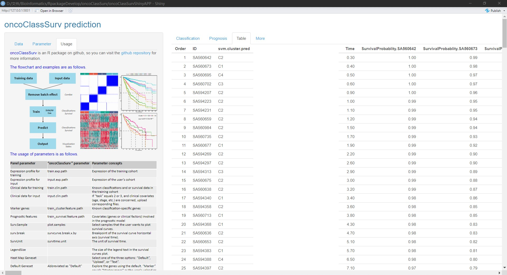

<!-- README.md is generated from README.Rmd. Please edit that file -->

# oncoClassSurv
[Download README](https://github.com/OliveryYL/oncoClassSurv/tree/master/man)

### Introduction

Hi, everyone! I’m Yang Li. In the era of precision medicine, the molecular characteristics of patients are increasingly valued for precise management and scientific research. 
I developed this R package because it will be useful for molecular classifications and individualized prognosis evaluation. 

The current R package involves two main fields: classifier for molecular characteristics, and survival risk over time. The function also provides useful visual output. I also
noticed that different datasets have batch effects, which increases the difficulty of accurate evaluation. To simplify this process, I optimized the function. When this function 
is executed, the batch effects between different datasets will be automatically removed. In addition, we initially used this R package for hepatocellular carcinoma (HCC), but
actually, other kinds of tumors or even non-tumor diseases can also benefit from it based on the user's customized training data. 

The evaluation of tumor molecular classifications is a prerequisite for achieving precise medical management. Based on pre-analyzed or learned sub-types with diverse clinical 
features (response to drugs, survival outcomes, etc.) and sub-type-specific marker genes, machine learning algorithms could be used for classification training, and thereafter 
personalized typing prediction could be achieved for any new-diagnosed patients. This classification can be used to guide clinical treatment and further scientific research.

The prognosis evaluation of tumor patients is a key concern for patients and clinical researchers. So far, there have been many nomograms based on gene expression for every 
type of tumor, which are dazzling. Although some of them are excellent, many nomograms lack external validation and are not convenient for external clinical practice validation. 
To address this practicality issue, we provide a calculation tool based on customized prognostic features, where users can use gene expression data or choose to add additional clinical 
covariates such as age, gender, stage, etc. This function can calculate the prognostic risk of each patient at different time points and plot a survival curve for each patient. 

Any questions or tips, please don’t hesitate to let me know!

### Installation

1)  Online
``` r
if(!require(devtools))install.packages("devtools")
if(!require(oncoClassSurv))devtools::install_github("OliveryYL/oncoClassSurv",upgrade = FALSE,dependencies = TRUE)
```
2)  Local
``` r
#Click the green button "code" on this page, then click "Download ZIP" to download it to your R working directory. Install it with:
devtools::install_local("oncoClassSurv-master.zip",upgrade = F,dependencies = T)
```

### Functions

The `oncoClassSurv()` provides three optional tasks based on two
training and predicting processes: (1) classifier; and (2) survival risk
over time. Users can select one task from the three tasks. Among them,
`"task=1"` means only calculating the classifications for patients;
`"task=2"` means only calculating the survival risk over time for
patients; `"task=3"` means calculating the classifications and survival
risk over time for patients. When the function of classification is
being performed, there are two available machine learning algorithms:
random forest (RF) and support vector machine (SVM). Notably, for the
prediction of HCC, we found high consistency between the RF and SVM
algorithms, and have set the optimal parameter of predicting HCC as the
default value of the R package. For other cancers, it is recommended to
validate the accuracy and consistency of prediction before conducting
large-scale predictions.

In addition, to overcome the tedious steps of programming and make it 
friendly for ordinary users, we developed an interactive application 
based on Shiny. Users only need to use the command `oncoClassSurv::oncoClassSurv_RunShiny()` 
to visit it. 
We also have packaged the shinyAPP as an executable desktop 
software (.exe) that can be run on the Windows operating system 
([click here](https://github.com/OliveryYL/oncoClassSurv_Expansion/)).

### Data prepare

The training and input data can all be customized.

1)  For tables of expression matrix, they should be “TPM” or “FPKM”
    normalized, without log() conversion, and without negative values.
    The first column name should be a customized label for features or
    genes, and the other column names should be sample names.

``` r
#training expression matrix:
train.tumor.exp<-data.table::fread(
  file = system.file("extdata", "train.tumor.exp.fpkm.txt",
                     package = "oncoClassSurv"),
  data.table = F,showProgress = T)
train.tumor.exp[1:6,1:3]
#>   Features TCGA-DD-AAVS-01A-11R-A41C-07 TCGA-DD-AAE3-01A-11R-A41C-07
#> 1   LAPTM5                   18.4255100                   18.9946800
#> 2    ITGB2                    3.5492310                    3.4017280
#> 3  ARHGDIB                   26.1084025                   25.7679609
#> 4    COTL1                    3.3672073                    6.2691545
#> 5     GBP5                    0.5242262                    0.2610244
#> 6 HLA_DQA1                    1.6251020                    3.9560500

#input expression matrix:
input.tumor.exp<-data.table::fread(
  file = system.file("extdata", "icgc.tumor.exp.fpkm.txt",
                     package = "oncoClassSurv"),
  data.table = F,showProgress = T)
input.tumor.exp[1:6,1:3]
#>   Features  SA560642  SA560673
#> 1   LAPTM5 22.513485 42.872559
#> 2    ITGB2 11.986753  9.630085
#> 3  ARHGDIB 32.644188 47.843265
#> 4    COTL1  9.996586 15.076860
#> 5     GBP5  7.466073  1.116859
#> 6 HLA_DQA1 44.956461 43.881046
```

2)  For tables of clinical data, the format could be “.rds” or “.csv”,
    “.txt”, “.xlsx”, etc., which could be imported by the function of
    `data.table::fread()`. The first column name should be named
    “sample_name”. Additional description for the clinical training
    data: If users need to train a classifier and perform prediction,
    please include the pre-prepared classification information of the
    samples in the clinical training data. The column name of the
    classification should be “Cluster”. In addition, the survival data
    is necessary if users want to train a Cox regression model. Other
    columns in the clinical training data should include at least the
    status (or event), and survival time, whose labels should be
    consistent with the parameters of “event” and “time” in the
    `oncoClassSurv()` function.  
    If users want to explore additional clinical factors, such as age,
    stage, gender, etc., please include the corresponding information.
    Additional description for the clinical input data: The survival
    data is not necessary. In addition, clinical factors are not always
    necessary depending on demands. However, if users want to explore
    additional clinical factors, please include the corresponding
    clinical factors in the clinical input data.

``` r
#For the training clinical data:
train.tumor.clin.surv=readRDS(system.file("extdata", "train.cluster.surv.rds",
                            package = "oncoClassSurv"))
head(train.tumor.clin.surv)
#>                              Cluster status   OS     Stage
#> TCGA-DD-AAVS-01A-11R-A41C-07      C1      0 60.8   Stage I
#> TCGA-DD-AAE3-01A-11R-A41C-07      C2      0 18.9   Stage I
#> TCGA-DD-A4NS-01A-11R-A311-07      C3      1 81.9   Stage I
#> TCGA-5R-AA1D-01A-11R-A38B-07      C3      0 15.0 Stage III
#> TCGA-BW-A5NO-01A-11R-A27V-07      C2      0  0.7 Stage III
#> TCGA-DD-AADL-01A-11R-A41C-07      C2      0 21.2   Stage I

#For the input clinical data:
input.clinsurv<-data.table::fread(file = system.file("extdata", "input_clinsurv.txt",
                     package = "oncoClassSurv"),
                     data.table = F)
head(input.clinsurv)
#>   sample_name status OS     Stage
#> 1    SA560642      1 44  Stage II
#> 2    SA560673      1 40  Stage IV
#> 3    SA560695      1 24  Stage II
#> 4    SA560702      0 55 Stage III
#> 5    SA594207      0 54  Stage II
#> 6    SA594223      1 43  Stage II
```

3)  The demands of the file format are the same as the clinical data
    file. The input data (expression matrix) should include all genes
    same as the marker genes used for training.

``` r
cluster_markergenes=readRDS(system.file("extdata", "train_cluster.features.rds",
                                       package = "oncoClassSurv"))
head(cluster_markergenes)
#> [1] "LAPTM5"   "ITGB2"    "ARHGDIB"  "COTL1"    "GBP5"     "HLA_DQA1"
```

4)  The demands of the file format are the same as the clinical data
    file. The input data (expression matrix and/ or clinical data)
    should include all features (significant survival genes and/ or
    additional clinical factors) same as features for training.

``` r
prog.signif.features<-readRDS(system.file("extdata", "train_survival.features.rds",
                                        package = "oncoClassSurv"))
head(prog.signif.features)
#> [1] "PCK2"    "G6PD"    "FTCD"    "ADH4"    "ALDH1L1" "PON1"
```

### Example

1)  This is an example for predicting classifications when `task=1`
    using `"RF"`:

``` r
library(oncoClassSurv)
results<-oncoClassSurv(input.exp.path = system.file("extdata", "icgc.tumor.exp.fpkm.txt",
                                                    package = "oncoClassSurv"),
                       miss_go.on=T,
                       task=1,rm.batch.effect=TRUE,plot.combatch=TRUE,
                       print.combat.plots=FALSE,
                       cluster.method="SVM",show.message=FALSE)
#> Input data is performing log2(expression+1)...
#> log2(expression+1) finished.
#> Found2batches
#> Adjusting for0covariate(s) or covariate level(s)
#> Standardizing Data across genes
#> Fitting L/S model and finding priors
#> Finding parametric adjustments
#> Adjusting the Data
results$original_combat.plots
```


``` r
head(results$svm.cluster$svm.cluster.pred)
#>                ID svm.cluster.pred
#> SA560642 SA560642               C2
#> SA560673 SA560673               C1
#> SA560695 SA560695               C4
#> SA560702 SA560702               C3
#> SA594207 SA594207               C2
#> SA594223 SA594223               C2
```

2)  This is an example for predicting classifications when `task=1`
    using `"SVM"`:

``` r
library(oncoClassSurv)
results<-oncoClassSurv(input.exp.path = system.file("extdata", "icgc.tumor.exp.fpkm.txt",
                                                    package = "oncoClassSurv"),
                       task=1,rm.batch.effect=TRUE,plot.combatch=TRUE,
                       print.combat.plots=FALSE,
                       cluster.method="RF",show.message=FALSE)
#> Input data is performing log2(expression+1)...
#> log2(expression+1) finished.
#> Found2batches
#> Adjusting for0covariate(s) or covariate level(s)
#> Standardizing Data across genes
#> Fitting L/S model and finding priors
#> Finding parametric adjustments
#> Adjusting the Data
head(results$rf.cluster$rf.cluster.pred)
#>                ID rf.cluster.pred
#> SA560642 SA560642              C2
#> SA560673 SA560673              C1
#> SA560695 SA560695              C4
#> SA560702 SA560702              C2
#> SA594207 SA594207              C2
#> SA594223 SA594223              C2
```

3)  This is an example for predicting survival risk over time when
    `task=2`:

``` r
library(oncoClassSurv)
results<-oncoClassSurv(train_survival.feature.path=system.file("extdata", "train_survival.features.rds",
                                                               package = "oncoClassSurv"),
                       input.exp.path = system.file("extdata", "icgc.tumor.exp.fpkm.txt",
                                                    package = "oncoClassSurv"),
                       input.clin.path = system.file("extdata", "input_clinsurv.txt",
                                                     package = "oncoClassSurv"),
                       task=2,rm.batch.effect=TRUE,plot.combatch=TRUE,
                       print.combat.plots=FALSE,
                       surv.t.custom=NULL,plot.surv.curve=TRUE,
                       survcurve.break.x.by = 12,print.survplot = FALSE,
                       plot.samples=c(1:10),show.message=FALSE)
#> Input data is performing log2(expression+1)...
#> log2(expression+1) finished.
#> Found2batches
#> Adjusting for0covariate(s) or covariate level(s)
#> Standardizing Data across genes
#> Fitting L/S model and finding priors
#> Finding parametric adjustments
#> Adjusting the Data
#> Warning: `gather_()` was deprecated in tidyr 1.2.0.
#> ℹ Please use `gather()` instead.
#> ℹ The deprecated feature was likely used in the survminer package.
#>   Please report the issue at <https://github.com/kassambara/survminer/issues>.
#> This warning is displayed once every 8 hours.
#> Call `lifecycle::last_lifecycle_warnings()` to see where this warning was
#> generated.
results$surv.probablity[1:6,1:5]
#>   Time SurvivalProbablity.SA560642 SurvivalProbablity.SA560673
#> 1  0.3                   0.9993512                   0.9942816
#> 2  0.4                   0.9980315                   0.9827386
#> 3  0.5                   0.9967081                   0.9712832
#> 4  0.6                   0.9960414                   0.9655569
#> 5  0.9                   0.9953614                   0.9597480
#> 6  1.0                   0.9946740                   0.9539069
#>   SurvivalProbablity.SA560695 SurvivalProbablity.SA560702
#> 1                   0.9956199                   0.9991132
#> 2                   0.9867604                   0.9973100
#> 3                   0.9779439                   0.9955027
#> 4                   0.9735276                   0.9945924
#> 5                   0.9690413                   0.9936644
#> 6                   0.9645237                   0.9927265
results$ggsurv.curve$ggsurv.curve$plot
```


4)  This is an example for predicting classifications and survival risk
    over time when `task=3`:

``` r
library(oncoClassSurv)
results<-oncoClassSurv(train_survival.feature.path=system.file("extdata", "train_survival.features.rds",
                                                               package = "oncoClassSurv"),
                       input.exp.path = system.file("extdata", "icgc.tumor.exp.fpkm.txt",
                                                    package = "oncoClassSurv"),
                       input.clin.path = system.file("extdata", "input_clinsurv.txt",
                                                     package = "oncoClassSurv"),
                       task=3,rm.batch.effect=TRUE,plot.combatch=TRUE,
                       print.combat.plots=FALSE,cluster.method="SVM",
                       surv.t.custom=NULL,plot.surv.curve=TRUE,
                       survcurve.break.x.by = 12,print.survplot = FALSE,
                       plot.samples=c(1:10),show.message=FALSE)
#> Input data is performing log2(expression+1)...
#> log2(expression+1) finished.
#> Found2batches
#> Adjusting for0covariate(s) or covariate level(s)
#> Standardizing Data across genes
#> Fitting L/S model and finding priors
#> Finding parametric adjustments
#> Adjusting the Data
head(results$svm.cluster$svm.cluster.pred)
#>                ID svm.cluster.pred
#> SA560642 SA560642               C2
#> SA560673 SA560673               C1
#> SA560695 SA560695               C4
#> SA560702 SA560702               C3
#> SA594207 SA594207               C2
#> SA594223 SA594223               C2
results$surv.probablity[1:6,1:5]
#>   Time SurvivalProbablity.SA560642 SurvivalProbablity.SA560673
#> 1  0.3                   0.9993512                   0.9942816
#> 2  0.4                   0.9980315                   0.9827386
#> 3  0.5                   0.9967081                   0.9712832
#> 4  0.6                   0.9960414                   0.9655569
#> 5  0.9                   0.9953614                   0.9597480
#> 6  1.0                   0.9946740                   0.9539069
#>   SurvivalProbablity.SA560695 SurvivalProbablity.SA560702
#> 1                   0.9956199                   0.9991132
#> 2                   0.9867604                   0.9973100
#> 3                   0.9779439                   0.9955027
#> 4                   0.9735276                   0.9945924
#> 5                   0.9690413                   0.9936644
#> 6                   0.9645237                   0.9927265
results$ggsurv.curve$ggsurv.curve$plot
```


### Interactive ShinyAPP
Run `ShinyAPP` by `oncoClassSurv_RunShiny()`:

``` r
library(oncoClassSurv)
oncoClassSurv_RunShiny()
```

Description: All `.pdf` or `.csv` files can be downloaded to the local disk.

1) Run `oncoClassSurv_RunShiny()` using the default settings.


2) Run `oncoClassSurv_RunShiny()` to predict the classifications for a customized cohort.


3) Run `oncoClassSurv_RunShiny()` to predict the prognosis for a customized cohort.


4) The output tables. 
The classification table is on the left. The prognosis table is on the right.


5) Users can select interesting samples for further research.


6) Analyses for curated samples and genes.


7) Survival curves and the process to remove the batch effect.


### Resource
Multiple versions of the `oncoClassSurv` Shiny APP are available, including the local R package, 
desktop executive, and online versions. Considering the uncertainty of the network, we 
prioritize recommending the local R package or the desktop executive version to achieve a better 
user experience.

Video introduction to the `oncoClassSurv` Shiny APP (https://v.youku.com/v_show/id_XNjA3MjgzNDM2OA==.html).

The desktop version (.exe) of the `oncoClassSurv` Shiny APP (https://github.com/OliveryYL/oncoClassSurv_Expansion/).

The online version of the `oncoClassSurv` Shiny APP (https://oncomanager.shinyapps.io/oncoClassSurv/).

Follow us for updates (https://github.com/OliveryYL/oncoClassSurv).
